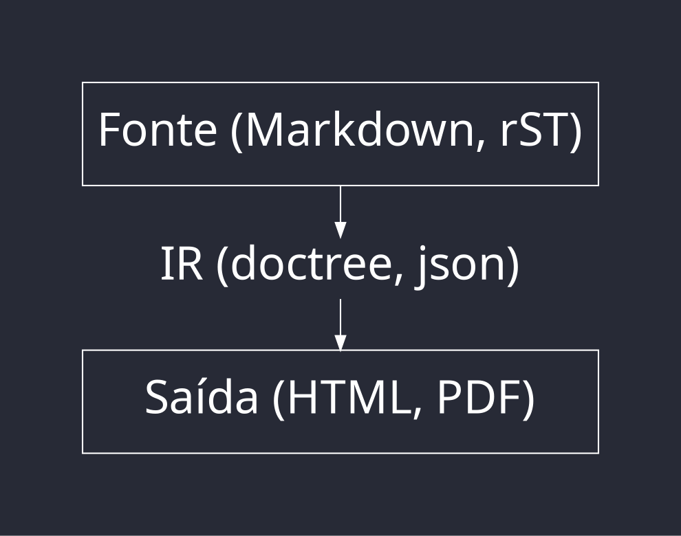

<!-- .slide: style="font-size: 24px;" -->

# Documentação bonita e organizada

 Ferramentas para facilitar a vida do seu time

<!-- Put the link to this slide here so people can follow -->
slides: https://hackmd.io/@melissawm/python-floripa-2025

---

### Pra começar...

- Quem _gosta_ de escrever documentação?
- Quem escreve documentação no seu projeto/empresa?
- Com que frequência você _lê_ documentação?
- Qual é o valor da documentação pra você?

---

### O que é documentação?

- Narrativa: tutoriais, guias, passo-a-passos, livros
- Docstrings, comentários de código, comentários em _code review_
- Videos, palestras, slides
- Communicações, mídias sociais
- Processos internos, _handbooks_

---

### Documentação vs. "Conteúdo"

- Estamos afogados em "informação" e "conteúdo"
- Fontes, reputação, objetivos: curadoria
- Busca e arquitetura da informação
- Perfis, linguagem, voz

_O objetivo é comunicar com outros seres humanos_

---

### Quem são seus leitores?

- Perfis e _user stories_
- Diferentes documentos para diferentes objetivos
- Accessibilidade
- Traduções
- Vieses e inclusão
- CLI, PDF, Web, mídia física, vídeo, blog: Seus leitores sabem onde te encontrar?
- **Seus colegas são seus clientes**

---

### Como organizar documentação narrativa?

- Pessoas gostam de encontrar informação rápido: livro vs. hipertexto
- Sinalização: "Se você já conhece Python, pule para o Capítulo 2."
- Busca
- Links cruzados

---

### Arquitetura da informação: DITA

- DITA: _Darwin Information Typing Architecture_
- Usa XML para criar conteúdo legível pelas máquinas
- Conteúdo organizado por _tópicos_, cada um num arquivo XML.
- Cada tópico tem um propósito: _Task_, _Concept_, _Reference_, _Glossary Entry_, e _Troubleshooting_.

---

### Arquitetura da informação: Diatáxis

https://diataxis.fr

---

### Arquitetura da informação: EPPO

https://everypageispageone.com/

---

### Arquitetura da informação: EPPO

"Organizar a informação não é mais a responsabilidade do escritor." - Mark Baker

Um tópico EPPO tem as seguintes características:

- É autocontido
- Tem um propósito específico e limitado
- Com frequência, segue um modelo (uma receita; um manual de utilização, uma review de um produto, etc)
- Supõe que o leitor é qualificado
- É a menor unidade de referência

---

<!-- .slide: style="font-size: 30px;" -->
### Arquitetura da informação: _Seven-action model_

https://passo.uno/seven-action-model/

---

### Arquiteturas da informação

- Não seja dogmático: adapte-se
- Ferramentas diferentes para objetivos diferentes
- Não otimize prematuramente!

---

### Documentação de código: API e docstrings

- "Comentários vão ficar desatualizados": só se você não incluir documentação no seu processo de desenvolvimento.
- _Clean code_ não significa que comentários são proibidos!
- "O quê" vs. "Por quê"
- [BOM](https://github.com/mkdocstrings/mkdocstrings/blob/main/src/mkdocstrings/_internal/extension.py#L213)/[MAU](https://github.com/nasa/progpy/blob/master/src/progpy/composite_model.py)

---

### DDD: Desenvolvimento guiado pela documentação

- DDD (_Docs-driven development_): na perspectiva to usuário, se um recurso não está documentado, _ele não existe_, e se um recurso está documentado incorretamente, _ele está quebrado_.

---

<!-- .slide: style="font-size: 32px;" -->
### Programação literária (_Literate programming_)

"Vamos mudar nossa atitude tradicional em relação à construção de programas: Ao invés de imaginarmos que nossa tarefa principal é instruir o computador, _vamos nos concentrar em explicar para seres humanos o que queremos que o computador faça_.
      
O praticante de programação literária pode ser visto como um ensaísta, cuja preocupação principal é a excelência no estilo e na exposição. Um autor assim, com dicionário em mãos, escolhe os nomes das suas variáveis com cuidado e explica o que cada uma delas significa."
- Donald Knuth. "Literate Programming (1984)"

---

<!-- .slide: style="font-size: 30px;" -->
### Programação (quase) literária: _Jupyter notebooks_

---

### Docs as code

- Usar as mesmas ferramentas para documentação e código (texto puro, controle de versão, lint, testes, DocOps, code review, issues)
- https://passo.uno/what-docs-as-code-means/
- https://thisisimportant.net/posts/docs-as-code-broken-promise/
- Escrita técnica: treinamento!
- Cuidado com crédito, autoria, limitações das ferramentas.

---

### Escrever e compilar

- Máquina de estados
- Jinja
- Plugins

---

### Escrever e compilar

- Linguagem de Markup: reST, Markdown, MyST Markdown
- No Python: Sphinx, MkDocs, MyST
    - Material for MkDocs/mkdocstrings
    - https://mystmd.org/guide
- AsciiDoc
- Quarto
- Outros: Confluence, Notion, Texto puro, Docusaurus, GitBook/MdBook

---

### Atualizar

- Imagens e vídeos
- Documentação executável (p. ex. JupyterBook)
- Revisões frequentes: use sua própria documentação!
- Documentação versionada

---

### Interatividade

- Documentação interativa
    - Jupyterlite/Pyodide
    - PyScript
    - MyST JS
- Convite à contribuição: todo o seu time ~~pode~~ deve escrever documentação!

---

### Lições das comunidades open source

- Em um time remoto e efêmero, _se não está documentado, não existe_
- Lidere pelo exemplo
- Valorize contribuições em documentação
- _Onboarding_: primeiro ponto de entrada
- Regras secretas
- Documente processos, decisões e discussões

---

## LLMs

- LLMs frequentemente erram, dão respostas sem sentido e inventam informações. Isso pode induzir ao erro e distrair o leitor da informação correta.
- LLMs podem ser úteis para resumir informações, ou para um ponto de partida rápido. Também podem ser úteis para indexar informação e identificar padrões na sua coleção de documentos.

---

## O que fazer?

- _Não dependa totalmente de ferramentas de IA._ Seja transparente com seus leitores.
- Esteja ciente das limitações das ferramentas que usar, e como elas podem criar confusão e conflito.
- Defina uma política de "uso aceitável" e use-a com seu time.

---

<!-- .slide: style="font-size: 30px;" -->
## Algumas recomendações (experiência própria!)

- Evite mídias efêmeras (Discord)
- Pouca documentação: difícil de achar informação!
- Muita documentação: difícil de achar informação!
- Documentação desatualizada/sem informações sobre a última atualização
- “Isso é fácil!”, “É só você.../Just do this”: não cause ansiedade nos seus leitores
- “foo”, “bar”: Não crie barreiras cognitivas desnecessárias

---

## Pra finalizar...

- Escrever documentação é um exercício em empatia.
- Seus leitores _não são_ você.
- Documentação é viva: nunca vai estar pronta.

---

### Obrigada!

- github.com/melissawm
- pynews.com.br/@melissawm