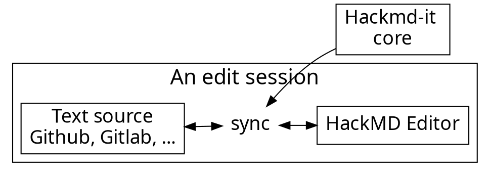

---
title: Python Floripa Março 2025
tags: talk
description: View the slide with "Slide Mode".
type: slide
---

<!-- .slide: style="font-size: 24px;" -->

# Documentação bonita e organizada

 Ferramentas para facilitar a vida do seu time

<!-- Put the link to this slide here so people can follow -->
slides: https://hackmd.io/@melissawm/python-floripa-2025

---

### Pra começar...

- Quem _gosta_ de escrever documentação?
- Quem escreve documentação no seu projeto/empresa?
- Com que frequência você _lê_ documentação?
- Qual é o valor da documentação pra você?

---

### O que é documentação?

- Narrative: tutorials, how-to guides, walkthroughs, books
- Docstrings, code comments, code review
- Video, talks, slides
- Communications, social media
- Internal processes, handbooks

---

### Documentação vs. "Conteúdo"

- Estamos afogados em "informação" e "conteúdo"
- Fontes, reputação, objetivos: curadoria
- Busca e arquitetura da informação
- Perfis, linguagem, voz

_O objetivo é comunicar com outros seres humanos_

### Quem são seus leitores?

- Perfis e _user stories_
- Diferentes documentos para diferentes objetivos
- Accessibilidade
- Traduções
- Vieses e inclusão

---

### Como organizar documentação narrativa?

- Pessoas gostam de encontrar informação rápido: livro vs. hipertexto
- Sinalização: "Se você já conhece Python, pule para o Capítulo 2."
- Busca
- Links cruzados

---

### Arquitetura da informação: DITA

- DITA: _Darwin Information Typing Architecture_
- Usa XML para criar conteúdo legível pelas máquinas
- Conteúdo organizado por _tópicos_, cada um num arquivo XML.
- Cada tópico tem um propósito: _Task_, _Concept_, _Reference_, _Glossary Entry_, e _Troubleshooting_.

---

### Arquitetura da informação: Diatáxis

---

### Arquitetura da informação: EPPO

---

### Arquitetura da informação: Seven-action model

https://passo.uno/seven-action-model/

---

### Arquiteturas da informação

- Não seja dogmático: adapte-se
- Ferramentas diferentes para objetivos diferentes
- Não otimize prematuramente!

---

### Documentação de código: API e docstrings

- "Comentários vão ficar desatualizados": só se você não incluir documentação no seu processo de desenvolvimento.
- _Clean code_ não significa que comentários são proibidos!
- "O quê" vs. "Por quê"

BOM: https://github.com/mkdocstrings/mkdocstrings/blob/main/src/mkdocstrings/_internal/extension.py#L213

MAU: https://github.com/nasa/progpy/blob/master/src/progpy/composite_model.py

---

### DDD: Desenvolvimento guiado pela documentação

- DDD (_Docs-driven development_): _from the perspective of a user, if a feature is not documented, then it doesn't exist, and if a feature is documented incorrectly, then it's broken._

---

### Programação literária (_Literate programming_)

- Jupyter notebooks
- MyST https://mystmd.org/guide

---

### Docs as code

- Usar as mesmas ferramentas para documentação e código (texto puro, controle de versão, lint, testes, DocOps, code review, issues)
- https://passo.uno/what-docs-as-code-means/
- https://thisisimportant.net/posts/docs-as-code-broken-promise/
- Escrita técnica: treinamento!
- Cuidado com crédito, autoria, limitações das ferramentas.

---

### Escrever e compilar

Markup language:
reST, Markdown, MyST Markdown
Documentation engine:
Sphinx, MkDocs
AsciiDoc
Quarto
Other approaches: Confluence, Notion, Plain Text, Docusaurus, GitBook/MdBook

---

## Compartilhar

- Seus leitores sabem onde te encontrar?

CLI
PDF
Web
Physical media
Video
Blog
Does your audience know where to find you?

---

## Atualizar

Images, videos
Executable docs
JupyterBook
MyST
Frequent reviews
Versioned docs

---

## Interagir

Interactive documentation
JupyterLite
PyScript
MyST JS
Translations
Docs on docs: how to contribute

---

## Lições das comunidades open source

- Em um time remoto e efêmero, _se não está documentado, não existe_
- Lidere pelo exemplo
- Valorize contribuições em documentação
- Onboarding: primeiro ponto de entrada
- Regras secretas
- Documente processos, decisões e discussões

---

## LLMs

- LLMs are frequently wrong, poisoned or nonsensical. They can be distracting and lead you down the wrong path.
- LLMs can be useful to summarize information for a quick starting point. They can help you index information and identify patterns in your corpus.

---

## My answer

Don’t rely entirely on AI tools, and make sure you are transparent with your readers.
Be mindful of the limitations of these tools and how they can create confusion and even conflict.
Develop a policy and agree on an approach with your team.

---

## Evite

Ephemeral media (Discord)
Too little docs: can't find the info! 
Too much docs: can't find the info! 
Outdated documentation, no clear timeline of last update
“This is easy!”, “Just do this”: don't cause anxiety in your audience
“foo”, “bar”: Unnecessary cognitive barriers

---

## Empatia

Writing documentation is an exercise in empathy.

Your audience is NOT you.

Docs are living things, they will never be finished.

---

---

### Obrigada!

- github.com/melissawm
- pynews.com.br/@melissawm---
title: Python Floripa Março 2025
tags: talk
description: View the slide with "Slide Mode".
type: slide
---

<!-- .slide: style="font-size: 24px;" -->

# Documentação bonita e organizada

 Ferramentas para facilitar a vida do seu time

<!-- Put the link to this slide here so people can follow -->
slides: https://hackmd.io/@melissawm/python-floripa-2025

---

### Pra começar...

- Quem _gosta_ de escrever documentação?
- Quem escreve documentação no seu projeto/empresa?
- Com que frequência você _lê_ documentação?
- Qual é o valor da documentação pra você?

---

### O que é documentação?

- Narrative: tutorials, how-to guides, walkthroughs, books
- Docstrings, code comments, code review
- Video, talks, slides
- Communications, social media
- Internal processes, handbooks

---

### Documentação vs. "Conteúdo"

- Estamos afogados em "informação" e "conteúdo"
- Fontes, reputação, objetivos: curadoria
- Busca e arquitetura da informação
- Perfis, linguagem, voz

_O objetivo é comunicar com outros seres humanos_

### Quem são seus leitores?

- Perfis e _user stories_
- Diferentes documentos para diferentes objetivos
- Accessibilidade
- Traduções
- Vieses e inclusão

---

### Como organizar documentação narrativa?

- Pessoas gostam de encontrar informação rápido: livro vs. hipertexto
- Sinalização: "Se você já conhece Python, pule para o Capítulo 2."
- Busca
- Links cruzados

---

### Arquitetura da informação: DITA

- DITA: _Darwin Information Typing Architecture_
- Usa XML para criar conteúdo legível pelas máquinas
- Conteúdo organizado por _tópicos_, cada um num arquivo XML.
- Cada tópico tem um propósito: _Task_, _Concept_, _Reference_, _Glossary Entry_, e _Troubleshooting_.

---

### Arquitetura da informação: Diatáxis

---

### Arquitetura da informação: EPPO

---

### Arquitetura da informação: Seven-action model

https://passo.uno/seven-action-model/

---

### Arquiteturas da informação

- Não seja dogmático: adapte-se
- Ferramentas diferentes para objetivos diferentes
- Não otimize prematuramente!

---

### Documentação de código: API e docstrings

- "Comentários vão ficar desatualizados": só se você não incluir documentação no seu processo de desenvolvimento.
- _Clean code_ não significa que comentários são proibidos!
- "O quê" vs. "Por quê"

BOM: https://github.com/mkdocstrings/mkdocstrings/blob/main/src/mkdocstrings/_internal/extension.py#L213

MAU: https://github.com/nasa/progpy/blob/master/src/progpy/composite_model.py

---

### DDD: Desenvolvimento guiado pela documentação

- DDD (_Docs-driven development_): _from the perspective of a user, if a feature is not documented, then it doesn't exist, and if a feature is documented incorrectly, then it's broken._

---

### Programação literária (_Literate programming_)

- Jupyter notebooks
- MyST https://mystmd.org/guide

---

### Docs as code

- Usar as mesmas ferramentas para documentação e código (texto puro, controle de versão, lint, testes, DocOps, code review, issues)
- https://passo.uno/what-docs-as-code-means/
- https://thisisimportant.net/posts/docs-as-code-broken-promise/
- Escrita técnica: treinamento!
- Cuidado com crédito, autoria, limitações das ferramentas.

---

### Escrever e compilar

Markup language:
reST, Markdown, MyST Markdown
Documentation engine:
Sphinx, MkDocs
AsciiDoc
Quarto
Other approaches: Confluence, Notion, Plain Text, Docusaurus, GitBook/MdBook

---

## Compartilhar

- Seus leitores sabem onde te encontrar?

CLI
PDF
Web
Physical media
Video
Blog
Does your audience know where to find you?

---

## Atualizar

Images, videos
Executable docs
JupyterBook
MyST
Frequent reviews
Versioned docs

---

## Interagir

Interactive documentation
JupyterLite
PyScript
MyST JS
Translations
Docs on docs: how to contribute

---

## Lições das comunidades open source

- Em um time remoto e efêmero, _se não está documentado, não existe_
- Lidere pelo exemplo
- Valorize contribuições em documentação
- Onboarding: primeiro ponto de entrada
- Regras secretas
- Documente processos, decisões e discussões

---

## LLMs

- LLMs are frequently wrong, poisoned or nonsensical. They can be distracting and lead you down the wrong path.
- LLMs can be useful to summarize information for a quick starting point. They can help you index information and identify patterns in your corpus.

---

## My answer

Don’t rely entirely on AI tools, and make sure you are transparent with your readers.
Be mindful of the limitations of these tools and how they can create confusion and even conflict.
Develop a policy and agree on an approach with your team.

---

## Evite

Ephemeral media (Discord)
Too little docs: can't find the info! 
Too much docs: can't find the info! 
Outdated documentation, no clear timeline of last update
“This is easy!”, “Just do this”: don't cause anxiety in your audience
“foo”, “bar”: Unnecessary cognitive barriers

---

## Empatia

Writing documentation is an exercise in empathy.

Your audience is NOT you.

Docs are living things, they will never be finished.

---

---

### Obrigada!

- github.com/melissawm
- pynews.com.br/@melissawm