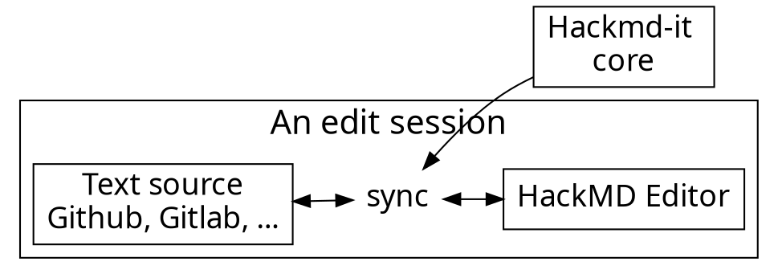

---
title: Python Floripa Março 2025
tags: talk
description: View the slide with "Slide Mode".
type: slide
---

<!-- .slide: style="font-size: 30px;" -->

# Documentação bonita e organizada

 Ferramentas para facilitar a vida do seu time

<!-- Put the link to this slide here so people can follow -->
slides: https://hackmd.io/@melissawm/python-floripa-2025

---

## Pra começar...

- Quem _gosta_ de escrever documentação?
- Quem escreve documentação no seu projeto/empresa?
- Com que frequência você _lê_ documentação?
- Qual é o valor da documentação pra você?

---

## O que é documentação?

- Narrative: tutorials, how-to guides, walkthroughs, books
- Docstrings, code comments, code review
- Video, talks, slides
- Communications, social media
- Internal processes, handbooks

---

## Documentação vs. "Conteúdo"

- Estamos afogados em "informação" e "conteúdo"
- Fontes, reputação, objetivos: curadoria
- Busca e arquitetura da informação
- Perfis, linguagem, voz

O objetivo é comunicar com outros seres humanos

Identify who your reader is
Profiles and user stories
Accessibility
Translations
Bias and inclusion

---

## Como organizar documentação narrativa?

- Pessoas gostam de encontrar informação rápido: livro vs. hipertexto
- Signposts
- Diataxis, every page is page one,
- https://passo.uno/seven-action-model/

---

## Documentação de código: API e docstrings

- "comments in code will get outdated"
- Clean code
- Why vs. what

---

## Literate programming

---

## Ferramentas: docs as code

- https://passo.uno/what-docs-as-code-means/
- https://thisisimportant.net/posts/docs-as-code-broken-promise/
- DDD (Docs-driven development): from the perspective of a user, if a feature is not documented, then it doesn't exist, and if a feature is documented incorrectly, then it's broken.
- Technical writers: don’t forget about them!
- Be careful with credit, authorship, and the limitations of your tools.

---

## Escrever e compilar

Markup language:
reST, Markdown, MyST Markdown
Documentation engine:
Sphinx, MkDocs
AsciiDoc
Quarto
Other approaches: Confluence, Notion, Plain Text, Docusaurus, GitBook/MdBook

---

## Compartilhar

- Seus leitores sabem onde te encontrar?

CLI
PDF
Web
Physical media
Video
Blog
Does your audience know where to find you?

---

## Atualizar

Images, videos
Executable docs
JupyterBook
MyST
Frequent reviews
Versioned docs

---

## Interagir

Interactive documentation
JupyterLite
PyScript
MyST JS
Translations
Docs on docs: how to contribute

---

## Lições das comunidades open source

- Em um time remoto e efêmero, _se não está documentado, não existe_
- Lidere pelo exemplo
- Valorize contribuições em documentação
- Onboarding: primeiro ponto de entrada
- Regras secretas
- Documente processos, decisões e discussões

---

## LLMs

- LLMs are frequently wrong, poisoned or nonsensical. They can be distracting and lead you down the wrong path.
- LLMs can be useful to summarize information for a quick starting point. They can help you index information and identify patterns in your corpus.

---

## My answer

Don’t rely entirely on AI tools, and make sure you are transparent with your readers.
Be mindful of the limitations of these tools and how they can create confusion and even conflict.
Develop a policy and agree on an approach with your team.

---

## Evite

Ephemeral media (Discord)
Too little docs: can't find the info! 
Too much docs: can't find the info! 
Outdated documentation, no clear timeline of last update
“This is easy!”, “Just do this”: don't cause anxiety in your audience
“foo”, “bar”: Unnecessary cognitive barriers

---

## Empatia

Writing documentation is an exercise in empathy.

Your audience is NOT you.

Docs are living things, they will never be finished.

---

---

### Architecture of information

DITA, or Darwin Information Typing Architecture, is a standard for writing, organizing, and publishing content. It's often used by technical writers to create content that can be reused across multiple platforms. 
How DITA works 

    DITA uses XML to create machine-readable content
    DITA organizes content into topics and maps
    DITA content is stored in a component content management system (CCMS)
    DITA content can be published in multiple formats, including PDF, PowerPoint, and mobile 

Benefits of DITA 

    DITA helps to standardize and leverage content
    DITA helps to improve collaboration
    DITA helps to ensure content accuracy and traceability
    DITA helps to increase the quality of content by standardizing it
    DITA helps to allow content to be reused, published to multiple formats, and translated efficiently 

DITA and CCMS
A DITA content management system (CCMS) can help companies to manage, create, and publish content. 

---

---

- <code class="orange">onMessage('event')</code>: Register event listener
- <code class="blue">sendMessage('event')</code>: Trigger event

---

### Obrigada!

- github.com/melissawm
- pynews.com.br/@melissawm---
title: Python Floripa Março 2025
tags: talk
description: View the slide with "Slide Mode".
type: slide
---

<!-- .slide: style="font-size: 30px;" -->

# Documentação bonita e organizada

 Ferramentas para facilitar a vida do seu time

<!-- Put the link to this slide here so people can follow -->
slides: https://hackmd.io/@melissawm/python-floripa-2025

---

## Pra começar...

- Quem _gosta_ de escrever documentação?
- Quem escreve documentação no seu projeto/empresa?
- Com que frequência você _lê_ documentação?
- Qual é o valor da documentação pra você?

---

## O que é documentação?

- Narrative: tutorials, how-to guides, walkthroughs, books
- Docstrings, code comments, code review
- Video, talks, slides
- Communications, social media
- Internal processes, handbooks

---

## Documentação vs. "Conteúdo"

- Estamos afogados em "informação" e "conteúdo"
- Fontes, reputação, objetivos: curadoria
- Busca e arquitetura da informação
- Perfis, linguagem, voz

O objetivo é comunicar com outros seres humanos

Identify who your reader is
Profiles and user stories
Accessibility
Translations
Bias and inclusion

---

## Como organizar documentação narrativa?

- Pessoas gostam de encontrar informação rápido: livro vs. hipertexto
- Signposts
- Diataxis, every page is page one,
- https://passo.uno/seven-action-model/

---

## Documentação de código: API e docstrings

- "comments in code will get outdated"
- Clean code
- Why vs. what

---

## Literate programming

---

## Ferramentas: docs as code

- https://passo.uno/what-docs-as-code-means/
- https://thisisimportant.net/posts/docs-as-code-broken-promise/
- DDD (Docs-driven development): from the perspective of a user, if a feature is not documented, then it doesn't exist, and if a feature is documented incorrectly, then it's broken.
- Technical writers: don’t forget about them!
- Be careful with credit, authorship, and the limitations of your tools.

---

## Escrever e compilar

Markup language:
reST, Markdown, MyST Markdown
Documentation engine:
Sphinx, MkDocs
AsciiDoc
Quarto
Other approaches: Confluence, Notion, Plain Text, Docusaurus, GitBook/MdBook

---

## Compartilhar

- Seus leitores sabem onde te encontrar?

CLI
PDF
Web
Physical media
Video
Blog
Does your audience know where to find you?

---

## Atualizar

Images, videos
Executable docs
JupyterBook
MyST
Frequent reviews
Versioned docs

---

## Interagir

Interactive documentation
JupyterLite
PyScript
MyST JS
Translations
Docs on docs: how to contribute

---

## Lições das comunidades open source

- Em um time remoto e efêmero, _se não está documentado, não existe_
- Lidere pelo exemplo
- Valorize contribuições em documentação
- Onboarding: primeiro ponto de entrada
- Regras secretas
- Documente processos, decisões e discussões

---

## LLMs

- LLMs are frequently wrong, poisoned or nonsensical. They can be distracting and lead you down the wrong path.
- LLMs can be useful to summarize information for a quick starting point. They can help you index information and identify patterns in your corpus.

---

## My answer

Don’t rely entirely on AI tools, and make sure you are transparent with your readers.
Be mindful of the limitations of these tools and how they can create confusion and even conflict.
Develop a policy and agree on an approach with your team.

---

## Evite

Ephemeral media (Discord)
Too little docs: can't find the info! 
Too much docs: can't find the info! 
Outdated documentation, no clear timeline of last update
“This is easy!”, “Just do this”: don't cause anxiety in your audience
“foo”, “bar”: Unnecessary cognitive barriers

---

## Empatia

Writing documentation is an exercise in empathy.

Your audience is NOT you.

Docs are living things, they will never be finished.

---

---

### Architecture of information

DITA, or Darwin Information Typing Architecture, is a standard for writing, organizing, and publishing content. It's often used by technical writers to create content that can be reused across multiple platforms. 
How DITA works 

    DITA uses XML to create machine-readable content
    DITA organizes content into topics and maps
    DITA content is stored in a component content management system (CCMS)
    DITA content can be published in multiple formats, including PDF, PowerPoint, and mobile 

Benefits of DITA 

    DITA helps to standardize and leverage content
    DITA helps to improve collaboration
    DITA helps to ensure content accuracy and traceability
    DITA helps to increase the quality of content by standardizing it
    DITA helps to allow content to be reused, published to multiple formats, and translated efficiently 

DITA and CCMS
A DITA content management system (CCMS) can help companies to manage, create, and publish content. 

---

---

- <code class="orange">onMessage('event')</code>: Register event listener
- <code class="blue">sendMessage('event')</code>: Trigger event

---

### Obrigada!

- github.com/melissawm
- pynews.com.br/@melissawm